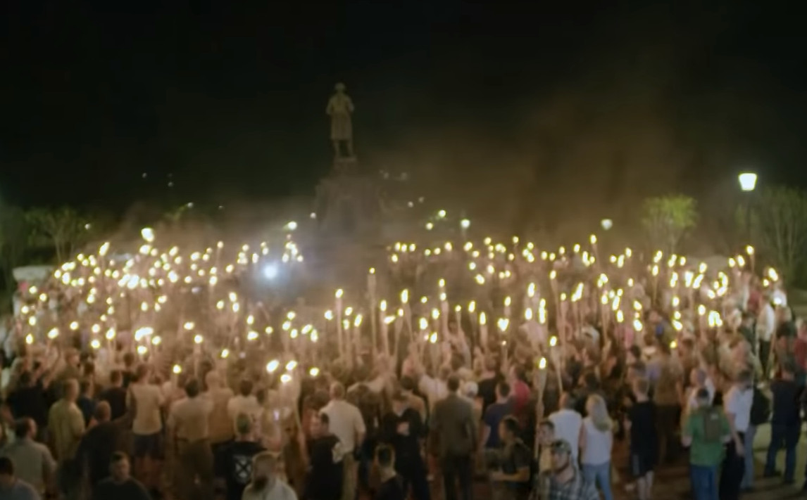
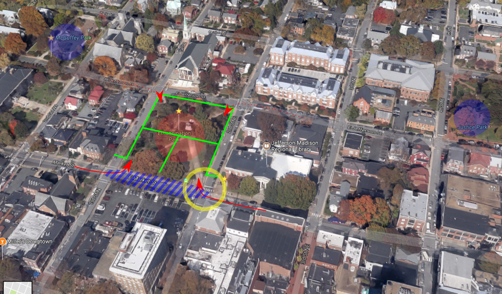
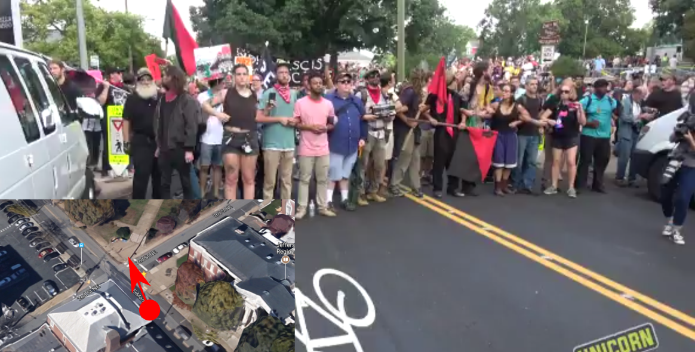
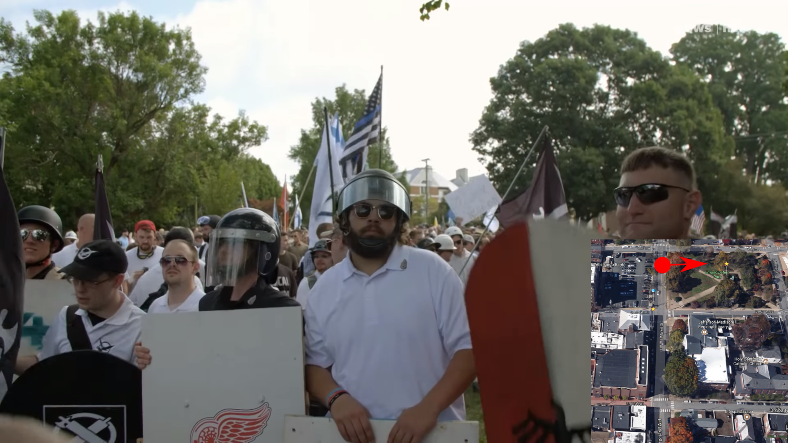
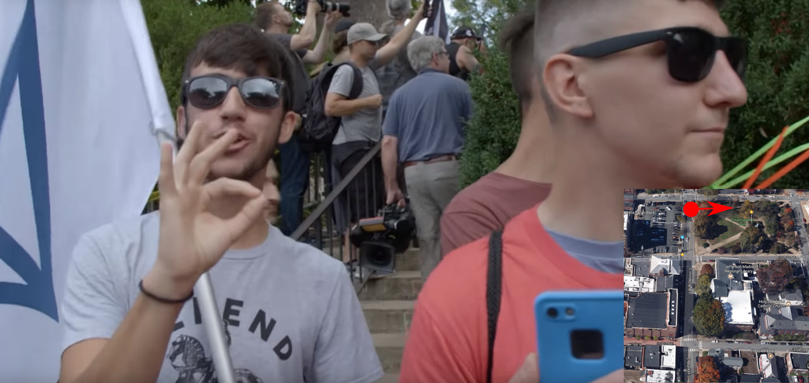
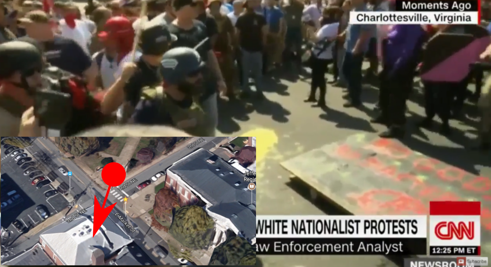
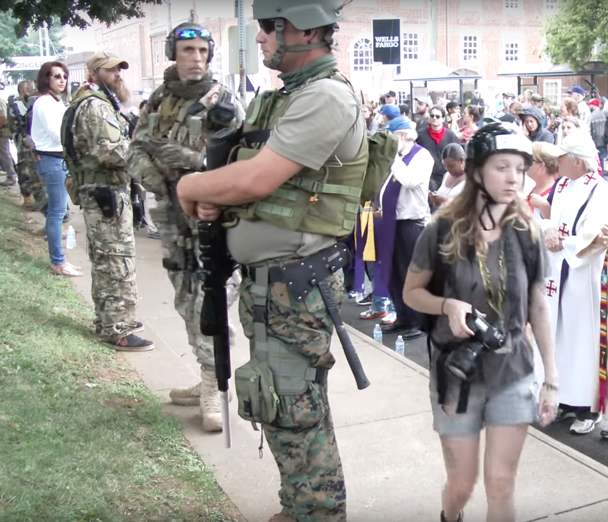
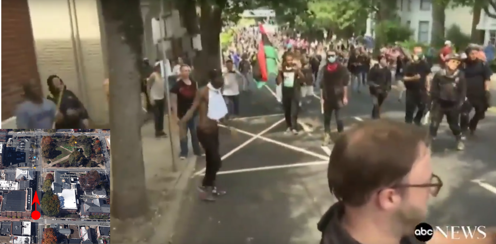
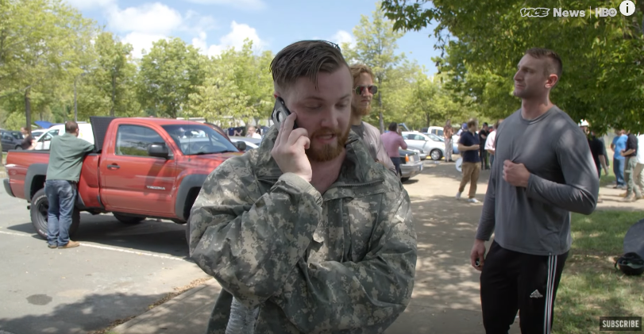
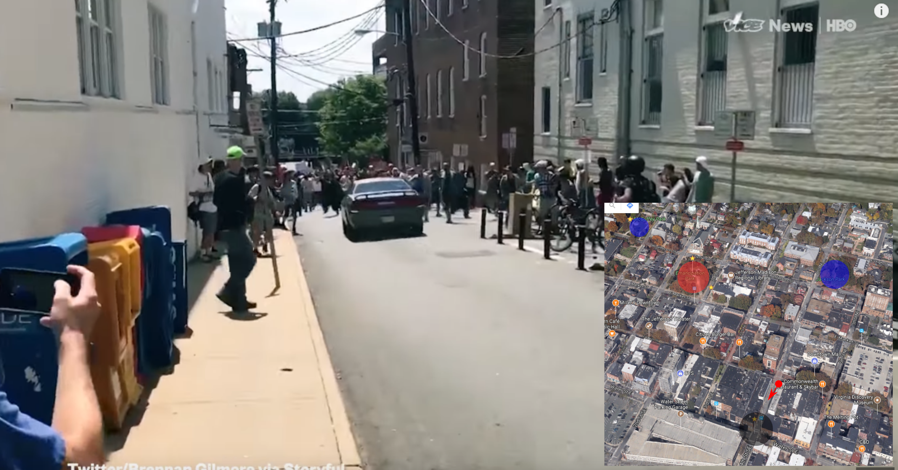

Ich habe keine einfache visuelle Chronologie der Gewalt gefunden, die am Samstag, dem 12. August 2017, in Charlottesville, Virginia, ausgebrochen ist. Also habe ich eine erstellt.

Der allgemeine Kontext: Die Kundgebung am Samstag wurde von  *White Supremacists* organisiert, was für „weisse Vorherrschaft“ oder „Überlegenheit der Weissen“ steht. Das sind rassistische, neonazistische Kreise, die ich im folgenden mit *WS* abkürze. Ihr Hauptthema war es, "die Rechte zu vereinen". Mit anderen Worten, es war ein Versuch der extremen Rechten, von der Mainstream-Rechtspartei in den USA akzeptiert zu werden.

Die WS protestierten gegen die Entfernung der Robert E. Lee-Skulptur in der Stadt. Lee befehligte die Konföderierte Armee von Nordvirginia und schliesslich alle konföderierten Streitkräfte im amerikanischen Bürgerkrieg gegen die Union. Lee, der selbst Sklavenhalter war, lehnte die Abschaffung der Sklaverei ab. Einige Ideologen leugnen dies und stellen Lee als eine edle Person dar. Das ist wichtig, um ihre Ideologie zu verstehen, aber [faktisch ist das nicht wahr](https://www.theatlantic.com/politics/archive/2017/06/the-myth-of-the-kindly-general-lee/529038/).

Also, ohne weitere Umschweife, hier ist die Chronologie. Lassen Sie es sich gesagt sein: Es gibt deutliche Anzeichen dafür, dass der Tag noch tödlicher hätte enden können.

Die Spannungen nahmen bereits am Freitagabend zu, als etwa 100 WS durch den Campus der University of Virginia marschierten und dabei "white lives matter", "you will not replace us", "Jews will not replace us", "anti-Black" und die Nazi-Parole "blood and soil" skandierten. Sie zeigten auch [den Nazigruss](https://en.wikipedia.org/wiki/Blood_and_Soil). (All dies ist [hier](https://www.youtube.com/watch?v=DkY7KlQ5CHI&start=4&autoplay=1) und [hier](https://www.youtube.com/watch?v=P54sP0Nlngg&start=8&end=128&autoplay=1) deutlich zu sehen.) Die Demonstranten umzingelten eine Statue von Thomas Jefferson, wo eine kleine Gruppe von Gegendemonstranten die Arme verschränkt hatte. Bald kam es zu Gewaltausbrüchen, bei denen auch Pfefferspray eingesetzt wurde. Die WS setzten auch ihre Tiki-Fackeln als Waffen ein.

Die Polizei beschloss, die beiden Proteste nicht zu trennen, wie eine Person [sagte](https://www.youtube.com/watch?v=DkY7KlQ5CHI&autoplay=1&start=46): "Die Polizei ist nirgendwo zu finden." Mit einiger Verzögerung löste sie die Proteste schliesslich doch auf. Dies ist ein Thema, das wir wieder sehen werden.

Die Rassisten hatten eine Genehmigung für eine Demonstration im Emancipation Park (früher Lee Park), der durch einen **roten** Kreis gekennzeichnet ist. Die Polizei errichtete **grün** markierte Absperrungen.

Offenbar herrschte Verwirrung darüber, wie die WS dorthin gelangen würden, wie die "Washington Post" [berichtet](https://www.washingtonpost.com/investigations/how-charlottesville-lost-control-amid-deadly-protest/2017/08/26/288ffd4a-88f7-11e7-a94f-3139abce39f5_story.html?hpid=hp_hp-more-top-stories_charlottesville-8pm%3Ahomepage%2Fstory&utm_term=.8eaae0681e36). Die Polizei ging davon aus, dass die Demonstranten von Norden über die E Jefferson St. (gestrichelte rote Pfeile) kommen würden. Die Demonstranten sagten, sie würden die E Market St(normale rote Pfeile) nehmen, weil der Zugang von Norden her blockiert war.

Die Gegendemonstranten erhielten Genehmigungen für den McGuffey Park und den Justice Park (früher Jackson Park), die blau markiert sind. Die Demonstranten hielten sich jedoch überall auf - insbesondere in der E Market St(blau schraffierter Bereich). Die Sprecherin von Charlottesville, Miriam I. Dickler, [erklärte](https://www.washingtonpost.com/investigations/how-charlottesville-lost-control-amid-deadly-protest/2017/08/26/288ffd4a-88f7-11e7-a94f-3139abce39f5_story.html?hpid=hp_hp-more-top-stories_charlottesville-8pm%3Ahomepage%2Fstory&utm_term=.8eaae0681e36): "Man braucht keine Genehmigung, um einen öffentlichen Park zu betreten, auch nicht, wenn eine andere Veranstaltung geplant ist", und das Gleiche gilt für "Strassen oder Bürgersteige, die an den Park angrenzen oder ausserhalb des Parks liegen".

An der [Ecke E Market St und 2nd St NE](https://www.google.ch/maps/place/38%C2%B001'52.3%22N+78%C2%B028'48.9%22W/@38.0303154,-78.4798022,122a,35y,326.12h,45t/data=!3m1!1e3!4m14!1m7!3m6!1s0x89b3863752f56a53:0xb407dd49e8f61480!2s10th+%26+Page,+Charlottesville,+VA+22903,+USA!3b1!8m2!3d38.0357082!4d-78.4908235!3m5!1s0x89b386267b1811c9:0x44c90f733bdd9523!7e2!8m2!3d38.031199!4d-78.480259) (gelber Kreis) bricht die erste Gewalt des Tages aus.

Das [Filmmaterial](https://twitter.com/UR_Ninja/status/897566928314781700?ref_src=twsrc%5Etfw&ref_url=http%3A%2F%2Fwww.latimes.com%2Fnation%2Fla-na-charlottesville-witnesses-20170815-story.html) zeigt deutlich, dass die Gegendemonstranten versuchten, den Zugang zum Emancipation Park an der [Ecke E Market St und 2nd St NE](https://www.google.ch/maps/place/38%C2%B001'52.3%22N+78%C2%B028'48.9%22W/@38.0303154,-78.4798022,122a,35y,326.12h,45t/data=!3m1!1e3!4m14!1m7!3m6!1s0x89b3863752f56a53:0xb407dd49e8f61480!2s10th+%26+Page,+Charlottesville,+VA+22903,+USA!3b1!8m2!3d38.0357082!4d-78.4908235!3m5!1s0x89b386267b1811c9:0x44c90f733bdd9523!7e2!8m2!3d38.031199!4d-78.480259) zu blockieren. Die WS liessen das nicht zu und gingen mit Schilden und Stöcken auf sie los. Die Polizei liess also wieder einmal zwei entschlossene Gruppen von Menschen ohne Puffer aufeinander los.

Dies geschah an der [Ecke E Market St und 2nd St NE](https://www.google.ch/maps/place/38%C2%B001'52.3%22N+78%C2%B028'48.9%22W/@38.0303154,-78.4798022,122a,35y,326.12h,45t/data=!3m1!1e3!4m14!1m7!3m6!1s0x89b3863752f56a53:0xb407dd49e8f61480!2s10th+%26+Page,+Charlottesville,+VA+22903,+USA!3b1!8m2!3d38.0357082!4d-78.4908235!3m5!1s0x89b386267b1811c9:0x44c90f733bdd9523!7e2!8m2!3d38.031199!4d-78.480259). Entgegen der Darstellung der Rechtsextremen zeigen [Aufnahmen](https://www.youtube.com/watch?v=P54sP0Nlngg&start=260&autoplay=1), die nur eine Ecke weiter an der [E Market St und 1st St NE](https://www.google.ch/maps/place/38%C2%B001'53.5%22N+78%C2%B028'51.8%22W/@38.031514,-78.483246,911m/data=!3m2!1e3!4b1!4m5!3m4!1s0x0:0x0!8m2!3d38.031514!4d-78.481052) in Vice's "Race and Terror" gedreht wurden, deutlich, dass andere WS bereits **um 10.30 Uhr** im Park waren. Die "Voice of America" hat noch [einen anderen Blickwinkel](https://en.wikipedia.org/wiki/File:Altercations_at_Charlottesville_Rally.webm) auf diese erste Konfrontation.

Sie werden sehen, dass neben dem Terroranschlag vor allem an der [Ecke E Market St und 2nd St NE](https://www.google.ch/maps/place/38%C2%B001'52.3%22N+78%C2%B028'48.9%22W/@38.0303154,-78.4798022,122a,35y,326.12h,45t/data=!3m1!1e3!4m14!1m7!3m6!1s0x89b3863752f56a53:0xb407dd49e8f61480!2s10th+%26+Page,+Charlottesville,+VA+22903,+USA!3b1!8m2!3d38.0357082!4d-78.4908235!3m5!1s0x89b386267b1811c9:0x44c90f733bdd9523!7e2!8m2!3d38.031199!4d-78.480259) und später weiter oben an der E Market St Gewalt ausbrach. Soweit ich sehen kann, dauerte die Konfrontation an der Ecke weit über eine Stunde bis 11:40 Uhr[(Bildmaterial](https://www.youtube.com/watch?v=C3SBftBznJ0&start=1609&autoplay=1)). Ich habe kein einziges Video gesehen, auf dem die Polizei die beiden Gruppen trennt.

Schätzungsweise 500 Demonstranten und mehr als tausend Gegenprotestler waren vor Ort. Nach Angaben der Stadt ([CNN](http://edition.cnn.com/2017/08/12/us/charlottesville-white-nationalists-rally/index.html)) wurden mindestens 14 Menschen bei Strassenschlachten verletzt.

Es war auch eine private Miliz von 32 Männern anwesend. Sie haben sich nicht an Gewalt beteiligt. Dennoch ist es bemerkenswert, dass sie militärische Waffen und _keine_ Schutzausrüstung trugen - was unter Druck ein Rezept für ein Desaster ist. Weitere Informationen über sie in [diesem Artikel](https://www.theguardian.com/us-news/2017/aug/15/charlottesville-militia-free-speech-violence) des britischen *Guardian*.
 

Gegen **11:40 Uhr**, kurz bevor die Kundgebung und die Reden im Emancipation Park beginnen sollten, erklärte die Polizei des Bundesstaates Virginia die Versammlung per Megaphon zu einer ungesetzlichen Versammlung, und die Bereitschaftspolizei drängte die weissen Rechtsextremisten aus dem Park ([Filmaufnahmen](https://www.youtube.com/watch?v=V7nQBuNczGQ)), was zu einer sehr chaotischen Situation führte. Daraufhin zog ein harter Kern von etwa 100 rechtsextremen Demonstranten in den etwa 3 km entfernten McIntire Park (gelber Kreis) um. ( [Wikipedia](https://en.wikipedia.org/wiki/Unite_the_Right_rally#August_12) hat solide Quellen dazu.)

Als sich die Demonstranten am Emancipation Park auflösten, ging eine Gruppe WS die E Market St. zurück. Ihnen folgten die Gegendemonstranten, die Stöcke trugen und sie eindeutig bedrohten.

Nach drei Häuserblocks, in denen sich die Demonstranten anschrieen, kam es zu Gewalttätigkeiten und zu der Szene, die überall in den Nachrichten zu sehen war: die Schlägerei vor dem [öffentlichen Parkhaus](https://www.google.ch/maps/@38.030525,-78.4778059,3a,75y,170.03h,80.85t/data=!3m6!1e1!3m4!1s4uLWaU5WUL1N875nyLHWgA!2e0!7i13312!8i6656). Filmmaterial von ABC News [hier](https://www.youtube.com/watch?v=C3SBftBznJ0&start=715&autoplay=1). Eine verletzte Person, die anschliessend behandelt wurde, [hier](https://twitter.com/jeffgiesea/status/896437943828717568).

Ein WS zog eine Waffe. Später zog auch die Polizei eine Waffe. Es werden keine Schüsse abgefeuert, aber man kann sehen, dass das Potenzial für tödliche Gewalt vorhanden war.

Offenbar gab es im Emancipation Park immer noch Leute mit Ausrüstung. Das Vice-Team [fing](https://www.youtube.com/watch?v=P54sP0Nlngg&start=524&autplay=1) einen Organisator ein, der der Polizei drohte: "(Unseren Leuten im Emancipation Park) wurde (von der Polizei) gesagt, dass sie nicht mit einem Fahrzeug durchkommen und sie abholen dürfen. **Ich werde mindestens 200 bewaffnete Leute schicken, um sie rauszuholen, wenn ihr unsere Leute nicht rausholt.**"

Dies geschah nach der Fahrt zum McIntire Park, also schätze ich, dass es gegen 12.30 Uhr war. Auch hier wurde die Drohung nicht realisiert, aber das Potenzial für tödliche Gewalt ist äusserst beunruhigend.

Nach der abgebrochenen Kundgebung fuhr um 13:45 Uhr ein *White Supremacist* mit seinem Auto absichtlich in eine grosse Gruppe Gegendemonstranten an der [Water ST E und 4th St SE](https://www.google.ch/maps/place/38%C2%B001'45.7%22N+78%C2%B028'46.6%22W/@38.0260246,-78.4746949,493a,35y,326.12h,44.84t/data=!3m1!1e3!4m14!1m7!3m6!1s0x89b3863752f56a53:0xb407dd49e8f61480!2s10th+%26+Page,+Charlottesville,+VA+22903,+USA!3b1!8m2!3d38.0357082!4d-78.4908235!3m5!1s0x89b38626bfd6a301:0xaae43a5f9e79a9a2!7e2!8m2!3d38.0293606!4d-78.4796105). Er verletzte 20 oder mehr Menschen. Ein 32-Jähriger starb später im Krankenhaus. ([Video mit allen Perspektiven](https://www.youtube.com/watch?v=P54sP0Nlngg&start=671&autplay=1))

Soweit ich weiss, scheint dieser Terroranschlag der letzte Gewaltakt an diesem Tag gewesen zu sein.

## Analyse / Schlussfolgerung

Im Folgenden unterscheide ich zwischen den chaotischen Szenen rund um die **Demonstration der White Supremacists** und dem anschliessenden **Autoanschlag**.

-   Bei dem Autoanschlag handelte es sich eindeutig um einen **terroristischen Anschlag eines White Supremacist** und es sollte ein Leichtes sein, ihn als solchen zu verurteilen.
-   Die Neonazis hatten **ein verfassungsmässiges Recht zu protestieren** und eine Genehmigung dafür. Die Gegendemonstranten versuchten eindeutig, **dieses Recht zu verletzen**, indem sie den Zugang zum Park an der [E Market St und 2nd St NE](https://www.google.ch/maps/place/38%C2%B001'52.3%22N+78%C2%B028'48.9%22W/@38.0303154,-78.4798022,122a,35y,326.12h,45t/data=!3m1!1e3!4m14!1m7!3m6!1s0x89b3863752f56a53:0xb407dd49e8f61480!2s10th+%26+Page,+Charlottesville,+VA+22903,+USA!3b1!8m2!3d38.0357082!4d-78.4908235!3m5!1s0x89b386267b1811c9:0x44c90f733bdd9523!7e2!8m2!3d38.031199!4d-78.480259) blockierten.
-   Bei der Kundgebung kam es **in der Tat auf beiden Seiten zu Gewalt** - einschliesslich des Einsatzes von Pfefferspray, Schlagstöcken und Schilden. Was die Ausrüstung betrifft, so hatten die "white supremacists" im Allgemeinen eine robustere Ausrüstung. Soweit ich gesehen habe, haben die Leute nicht-tödliche Gewaltmittel eingesetzt.
-   Der **Terroranschlag ist nicht die Schuld der Polizei**. Tatsächlich ist es so gut wie unmöglich ist, "weiche" Ziele gegen so primitiven Terrorismus wie Autoanschläge zu schützen.
-   Die Gewalt an der Kundgebung im und um den Park (nochmal: _nicht_ der Terroranschlag) scheint mir ein **taktischer Fehler der Polizei** zu sein: Bei solchen extremistischen Kundgebungen muss mit gewalttätigen Auseinandersetzungen gerechnet werden. Ein Neonazi und ein Antifa-Demonstrant werden unweigerlich versuchen, sich gegenseitig die Köpfe einzuschlagen. Daher war es meiner Meinung nach unklug, die **Neonazis und die Gegendemonstranten nicht** von Anfang an zu trennen. Wenn es an Ressourcen mangelte, dann wäre dies ein politisches Versagen, diese Ressourcen bereitzustellen.  
    Dies wird durch die [Erklärung](https://acluva.org/20108/aclu-of-virginia-response-to-governors-allegations-that-aclu-is-responsible-for-violence-in-charlottesville/) von Claire G. Gastanaga, der geschäftsführenden Direktorin der ACLU of Virginia, bekräftigt: "Das Polizeiaufgebot am Samstag war bei der Verhinderung von Gewalt nicht wirksam. Ich war vor Ort und habe mich direkt an den Minister für öffentliche Sicherheit und den Leiter der Virginia State Police gewandt, weil die Barrikaden im Park, die den Zugang der ankommenden Demonstranten beschränkten, und die fehlende physische Trennung von Demonstranten und Gegendemonstranten auf der Strasse zum Gewaltpotenzial beitrugen. Sie haben nicht reagiert. Tatsächlich **standen die Strafverfolgungsbehörden passiv da und schienen darauf zu warten, dass es zu Gewalt kommt, damit sie einen Grund hätten, den Notstand auszurufen, eine 'ungesetzliche Versammlung' zu erklären und das Gebiet zu räumen.**"
-   **Zwei Szenen, die** meiner Meinung nach **nicht genug Aufmerksamkeit erhalten**: Dass ein Neonazis damit drohte, "mindestens **200 bewaffnete Männer**" ins Stadtzentrum zu schicken, und dass mehrere Personen auf dem Parkplatz **ihre Waffen zogen**. Diese Vorfälle hätten leicht zu mehr Todesopfern führen können. 

_Update 27. August 2017: Ich habe eine detailliertere Karte hinzugefügt, die auf [einem Bericht](https://www.washingtonpost.com/investigations/how-charlottesville-lost-control-amid-deadly-protest/2017/08/26/288ffd4a-88f7-11e7-a94f-3139abce39f5_story.html?hpid=hp_hp-more-top-stories_charlottesville-8pm%3Ahomepage%2Fstory&utm_term=.8eaae0681e36) der "Washington Post" basiert._